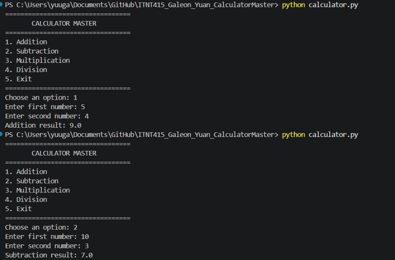
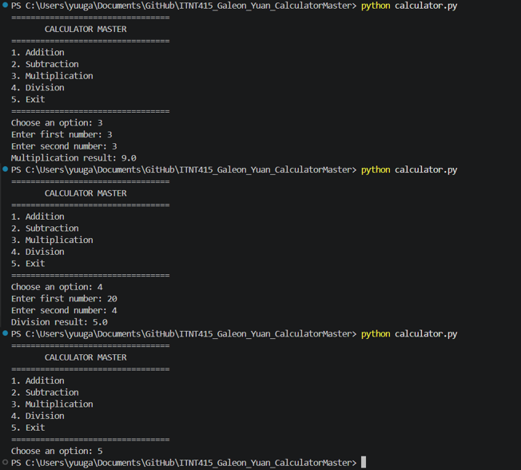

# Calculator Master

## Student Name
Yuan Galeon

## Course and Section
BIT41

## Project Description
Calculator Master is a simple menu-driven Python calculator developed using Python, Git, and GitHub. The project demonstrates source code management, feature branching, commits, pull requests, approvals, and merge operations.

## Branch Structure

- main
- addition_Galeon
- subtraction_Galeon
- multiplication_Galeon
- division_Galeon

## Program Features

- Addition
- Subtraction
- Multiplication
- Division
- Menu-driven interface
- Continuous execution
- User input validation
- Invalid input handling
- Division-by-zero handling
- Exit option

## Sample Execution

